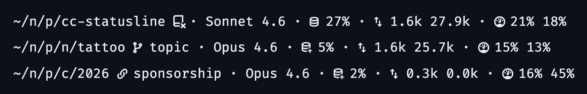

# cc-statusline

A Go program for [Claude Code's statusline](https://docs.anthropic.com/en/docs/claude-code/statusline) that displays session info in a compact, Nerd Font-styled format with clickable OSC 8 hyperlinks.

<!--
~/n/p/cc-statusline  · Sonnet 4.6 · 󱘲 27% · 󰓢 1.6k 27.9k · 󰊚 21% 18%
~/n/p/n/tattoo 󰘬 topic · Opus 4.6 · 󱘳 5% · 󰓢 1.6k 25.7k · 󰊚 15% 13%
~/n/p/c/2026 󰌹 sponsorship · Opus 4.6 · 󱘳 2% · 󰓢 0.3k 0.0k · 󰊚 16% 45%
-->


Each line shows: **CWD** · **Model** · **Context usage** · **Tokens** (in/out) · **Rate limits** (5h/7d). Git branch or worktree name appears after the path when not on main. Empty segments are omitted automatically. CWD, worktree name, and rate limits are clickable hyperlinks.

## Requirements

- Go 1.21+
- A [Nerd Font](https://www.nerdfonts.com/) in your terminal
- A terminal with OSC 8 hyperlink support (Ghostty, iTerm2, Kitty, WezTerm)

## Install

### Homebrew

```sh
brew install rileychh/tap/cc-statusline
```

### Go

```sh
go install github.com/rileychh/cc-statusline@latest
```

### Nix flakes

```nix
{
  inputs = {
    cc-statusline.url = "github:rileychh/cc-statusline"
    cc-statusline.inputs.nixpkgs.follows = "nixpkgs";
  };

  # In your system packages:
  environment.systemPackages = [
    inputs.cc-statusline.packages.${pkgs.stdenv.hostPlatform.system}.default
  ];
}
```

## Configure

Add to `~/.claude/settings.json`:

```json
{
  "statusLine": {
    "type": "command",
    "command": "cc-statusline"
  }
}
```

The binary must be in your `PATH` (e.g. in `GOBIN`).

If you're using Nix, it can be installed with a single configuration:

```json
{
  "statusLine": {
    "type": "command",
    "command": "nix run github:rileychh/cc-statusline"
  }
}
```

## Customization

Segments are composable functions with the signature `func(*StatusInput) string`. To add, remove, or reorder segments, edit the slice in `main()`:

```go
fmt.Print(render(&input, []segment{
    cwdSegment,
    modelSegment,
    contextSegment,
    tokensSegment,
    rateLimitsSegment,
}, " · "))
```

Return `""` from a segment to skip it.
